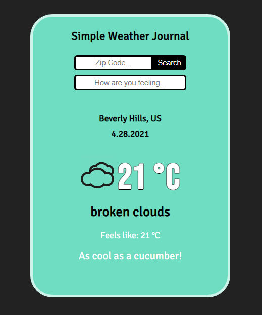

# Weather-Journal
Udacity Front End project 3 - Weather Journal App

<!--TABLE OF CONTENTS-->
<ol>
  <li><a href="#about-the-project">About The Project</a></li>
  <li><a href="#getting-started">Getting Started</a></li>
    <ul>
      <li><a href="#prerequisites">Prerequisites</a></li>
      <li><a href="#installation">Installation</a></li>
    </ul>
  <li><a href="#acknowledgements">Acknowledgements</a></li>
</ol>

<!-- ABOUT THE PROJECT -->
## About The Project




## Getting Started

<a href="https://nodejs.org/en/"><b>Node</b></a> is required to run this program.

### Prerequisites

npm
```sh
npm install -g npm
```
Dependencies and middleware
```sh
npm install express
```
```sh
npm install body-parser
```
```sh
npm install cors
```

### Installation

Initializing the server
```sh
node server.js
```
Access the localhost on port 8000
```sh
http://localhost:8000/
```
  
  
## Acknowledgements
<a href="https://www.alessioatzeni.com/meteocons/#">Meteocons</a>


